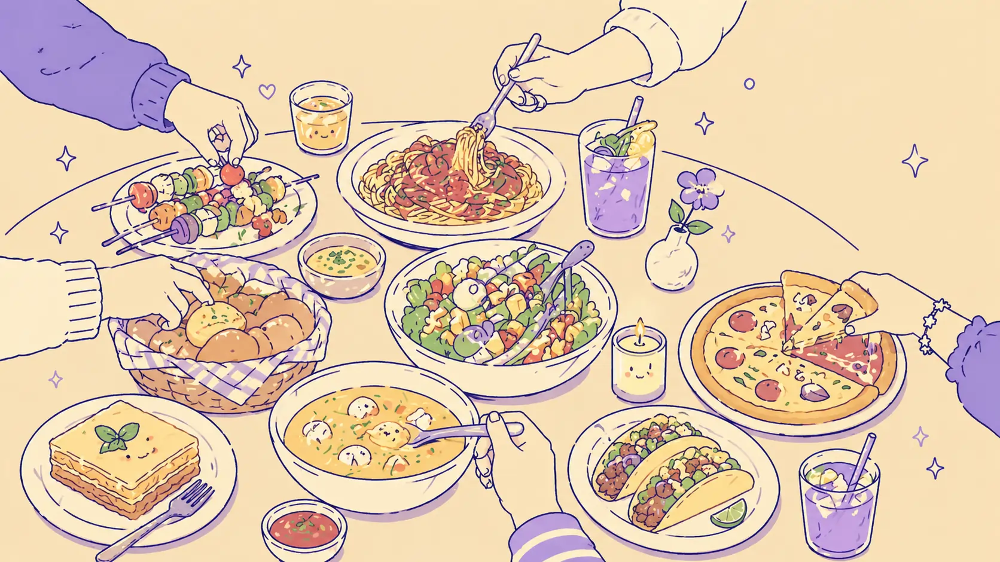

# nth-supper

> A portable Agent Skill that lets any AI agent run a collaborative group food ordering session via Swiggy MCP — in Slack, Discord, Telegram, or any chat surface.



## What this is

`nth-supper` is a behaviour skill, not an application. Drop it into any agent that supports the [Agent Skills open standard](https://agentskills.io/specification.md) and has access to the Swiggy MCP servers, and the agent will know how to coordinate a group food order from "let's order food" to "delivered".

The skill teaches the agent:

- A five-stage ordering state machine — BROWSING → COLLECTING → VOTING → PLACING → COMPLETE
- Which Swiggy MCP tools to chain at each stage
- How to coordinate multiple humans building one shared cart
- How chat reactions become confirmations and votes
- How to assign a party leader for payment and delivery
- When to surface dietary preferences and group order history from memory
- How to reference orders with `#human-id` slugs like `#swift-mango-lands`
- How to handle edge cases — minimum order value, opt-outs, restaurant unavailability, voting timeouts, network errors

## Roles in a session

Two roles exist in every order:

- **Party leader** — one person, on the hook for the order. Pays, sets the delivery address, signals when the cart closes, and gives the final ✅ that triggers placement. Picked at session start (group memory's default leader if any, otherwise the user who triggered) and confirmed explicitly in the opening message. Reassignable at any time.
- **Guests** — everyone else. Add their own items in plain English, react ✅ on the voting summary to confirm or ❌ to opt out, can volunteer to take over the leader role. Cannot close the cart, change the address, or trigger placement.

## Requirements

- An AI agent compatible with the Agent Skills standard (Claude Code, Goose, OpenCode, Kilocode, or any other Skills-aware agent)
- Access to the Swiggy MCP servers (food, instamart, dineout)
- A multi-user chat surface that supports `@mentions` and reactions

## Installation

### Recommended — `npx skills add`

The fastest way for any Skills-aware agent (Claude Code, Goose, OpenCode, Kilocode, etc.):

```bash
npx skills add ashishk1331/nth-supper
```

This pulls `skills/nth-supper/` from the GitHub repository and installs it into your agent's active skills directory.

## How to use it

Once installed, the skill auto-activates when someone in a group chat says something like:

- "let's order food"
- "start a group order"
- "order dinner for the team"
- "supper time"
- "what should we eat"

The agent will generate a session id (`#brave-pepper-flies`), open a cart, and run the rest of the flow. Members add items in plain English, react ✅ to confirm, and the party leader gives the final go-ahead before the order is placed.

You don't need to teach members new commands — natural conversation works. Reactions on the agent's tracked messages (the cart summary and the placing-confirmation message) are the primary confirmation channel.

## The ordering process

```
BROWSING → COLLECTING → VOTING → PLACING → COMPLETE
                                       ↘ CANCELLED
```

| Stage | What happens | Trigger to advance |
|---|---|---|
| **BROWSING** | On activation: agent generates a session id (`#brave-pepper-flies`), sets the triggering user as provisional party leader, and loads group memory. Then surfaces the group's usuals or runs `swiggy_search_restaurants`. Group converges on one restaurant; menu is fetched once and cached. | One restaurant is named and confirmed |
| **COLLECTING** | Cart is open. Each member adds items in plain text. Agent posts a running summary, flags dietary conflicts silently, and asks quiet members once. | Party leader closes the cart |
| **VOTING** | Agent posts a final summary; members react ✅ to confirm or ❌ to opt out. `swiggy_check_availability` runs in the background. Reactions are acknowledged silently. | All confirmed (or 10-minute timeout) |
| **PLACING** | Idempotency key generated once. `swiggy_place_order` is called with the leader's final ✅; retries reuse the same key on network errors. | Swiggy returns an order id |
| **COMPLETE** | Tracking link, on-demand status updates, archival, async memory extraction. A delivery confirmation message invites ❤️ reactions for restaurant-affinity memory. | (terminal) |

Every stage has a detailed playbook in [`skills/nth-supper/states/`](skills/nth-supper/states/) — the agent reads the relevant file when it transitions in.

## A worked example

A complete 10-message Friday team lunch is in [`skills/nth-supper/examples/sample-session.md`](skills/nth-supper/examples/sample-session.md), showing every state transition, every Swiggy tool call, and every reaction-driven confirmation.

## Skill structure

```
skills/nth-supper/
├── SKILL.md                       Overview, invariants, when to activate
├── states/
│   ├── browsing.md                Activation pre-flight, search, restaurant lock, single menu fetch
│   ├── collecting.md              Open cart, per-member tracking, dietary nudges
│   ├── voting.md                  Summary message, reactions, timeout handling
│   ├── placing.md                 Idempotent placement, retry rules, business errors
│   └── complete.md                Tracking, archival, async memory extraction
└── examples/
    └── sample-session.md          End-to-end 10-message group order
```

The skill follows the [Agent Skills specification](https://agentskills.io/specification.md): YAML frontmatter with `name` and `description`, body under 500 lines, references one level deep, progressive disclosure so reference files load only when needed.

## Customising

This skill is text. To adapt it:

- **Different food platform** — replace Swiggy MCP tool names in `SKILL.md` and each `states/*.md` with your platform's MCP tool names. The state machine, coordination rules, and edge-case logic carry over unchanged.
- **Different reaction conventions** — the ✅/❌/🔥/😐 mapping in `SKILL.md` is illustrative; adjust to your group's culture.
- **Different timeouts** — the 10-minute voting window in `states/voting.md` is a default, not a hard rule.
- **Different ID format** — `#human-id` slugs are convention; any human-readable scheme works.

After editing, validate with `skills-ref validate ./skills/nth-supper`.

## Architecture (for the curious)

This skill was extracted from a fuller project specification — a self-hostable bot that runs the same flow with persistent memory (Postgres + FalkorDB), session locks, and three-layer context-window compaction. The skill captures the *behavioural* layer of that design so any agent — even one without bespoke infrastructure — can run the conversation correctly.

If you're building the persistent backend, the original design lives in commit history under `ARCHITECTURE.md`.

## License

MIT — see [`LICENSE`](LICENSE).
